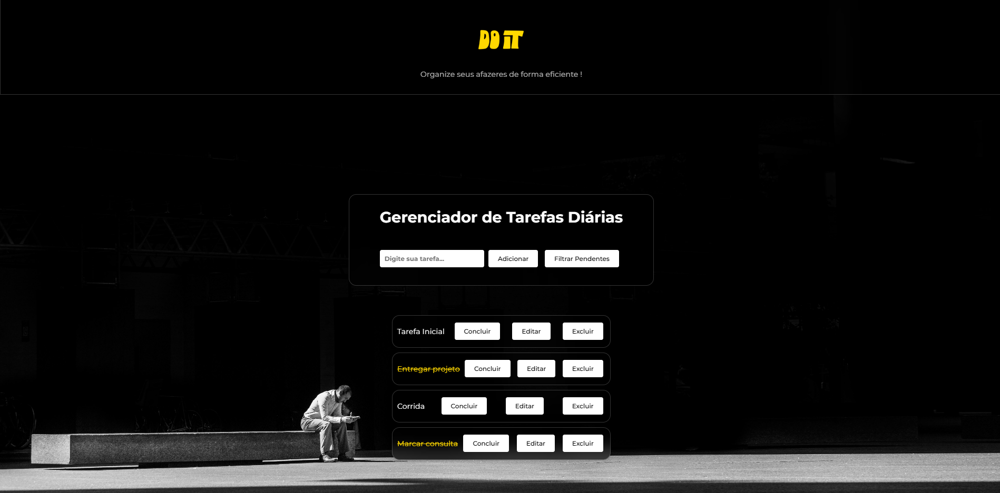

# 🗂️ Gerenciador de Tarefas Diárias

Esse projeto consiste em uma página web que permite aos usuários adicionar, editar, filtrar e gerenciar suas tarefas diárias.
O projeto utiliza **HTML** para a estrutura, **CSS** para estilização e **JavaScript** para a lógica, como foco na manipulação do DOM e no uso de conceitos avançados como **destructing, spread/rest, estruturas de repetição e métodos de array**.



## 💎 Tecnologias Utilizadas


## 🏁 Como executar o projeto

1. Clone o repositório

```bash
git clone https://github.com/GabrielRossi01/gerenciador-tarefas.git
```
2. Abra o arquivo `index.html` no navegador

3. Adicione, edite e gerencie suas tarefas !!

## 🧑‍💻 Desenvolvimento

Esse projeto foi desenvolvido por: **Gabriel Rossi**
